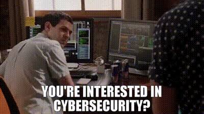

# Hi, I'm Halima! 

<h2 align="center"> About Me</h2>

🎓 IT student specializing in Cybersecurity

  

🔐 Interested in information security and cybersecurity

  

🛠️ I enjoy learning through hands-on projects

  

🌱 Currently learning more about cyber risk, security controls, and GRC

  

💬 Always happy to learn, share ideas, and ask questions

---

<h3>Thanks for stopping by! </h3>

Feel free to explore my repositories and see what I'm learning and building.

