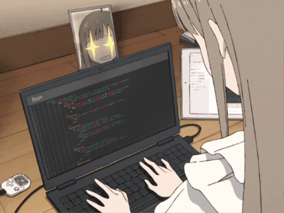

# Hi, I'm Halima

---

## About Me

- IT student specializing in **Cybersecurity**
- I enjoy learning through hands-on projects
- Currently exploring cyber risk, security controls, and GRC
- Always happy to learn, share ideas, and ask (probably too many) questions

  

---

## Tech & Tools

---

## GitHub Stats

---

## Currently Learning

  

Looking deeper into cyber risk management, security controls, and GRC frameworks.

---

## Thanks for stopping by

Feel free to explore my repositories and see what I'm learning and building.

