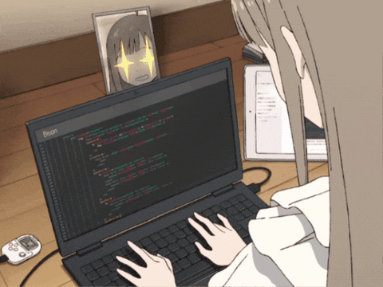

# Hi, I'm Halima

**Cybersecurity · Backend Development · Secure Systems**

*Curious about how things work, and how to make them more secure.*

 

## About Me

<table>
  <tr>
    <td width="60%" valign="middle">

- Interested in **cybersecurity**, **backend development**, and **building secure systems**
- I like understanding what happens behind the scenes, from application logic to vulnerabilities
- I learn by building, experimenting, breaking things safely, and documenting what I discover

</td>
    <td width="40%" align="center" valign="middle">

</td>
  </tr>
</table>

 

## Tech & Tools

| | |
|:---:|:---|
| **Security** |    |
| **Languages** |    |
| **Tools** |  |

 

## Let's Connect

Feel free to explore my repositories and see what I'm learning and building.

